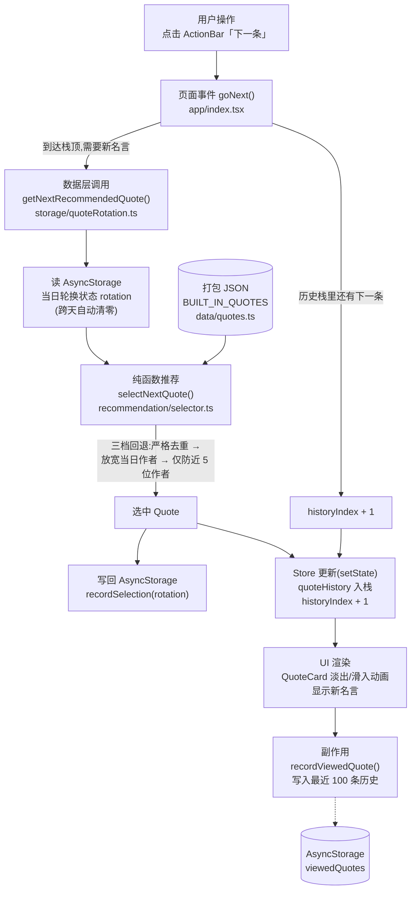
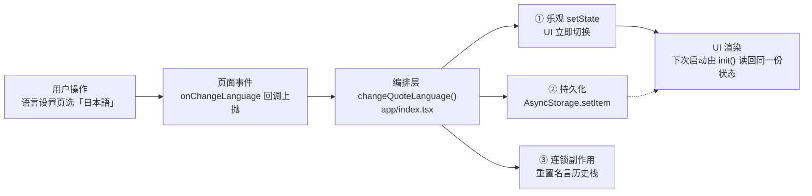
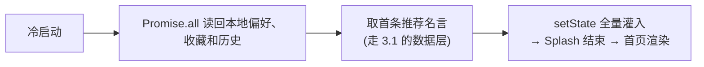

# ECHO 架构文档

> ECHO 是一个**完全离线**的每日名言 App(Expo / React Native,iOS 为主)。
> 3,925 条三语名言(英/简中/日)与作者语境全部打包进应用,没有后端、没有网络请求;
> 所有"数据交互"都发生在 打包 JSON(只读目录) 与 AsyncStorage(用户状态) 之间。
> 核心体验:启动 → 按心情偏好推荐一条名言 → 左右切换/收藏/历史/分享。

---

## 1. 目录结构

```
echo/
├── assets/                  # 打包资源:三份名言目录 JSON(1282/823/1820 条)、图标、字体贴图
│   ├── quotes.json          #   英文名言目录
│   ├── quotes.zh-Hans.json  #   简中名言目录
│   └── quotes.ja.json       #   日文名言目录
├── QUOTE_CONTEXTS.json      # 作者生平 + 每条名言的语境(6.5MB,供 context 页使用)
├── src/
│   ├── app/                 # expo-router 入口层
│   │   ├── _layout.tsx      #   路由壳(Stack,单路由)
│   │   └── index.tsx        #   ★ 唯一路由:所有页面状态机 + 全部业务编排(1050 行)
│   ├── screens/             # 页面级组件(设置、主题、语言、来源、语境详情等)
│   ├── components/
│   │   ├── home/            #   首页拆件:QuoteCard / ActionBar / HistorySheet / ShareSheet …
│   │   └── common/          #   跨页面组件:SplashScreen / ArchiveBackground
│   ├── data/                # 只读数据访问层(打包 JSON → 校验 → 冻结 → 内存索引)
│   │   ├── quotes.ts        #   名言目录:校验/去重/Map 索引/按类目查询
│   │   └── quoteContexts.ts #   语境目录:按 quote_id / author_ref 建 Map 索引
│   ├── storage/             # 可写持久层(AsyncStorage,每文件一个领域)
│   │   ├── preferences.ts   #   主题/字体/语言/心情/onboarding 等偏好
│   │   ├── storageMutationQueue.ts # 全局存储写入队列,与 Clear All 串行
│   │   ├── savedQuotes.ts   #   收藏(严格快照校验,写入走全局队列)
│   │   ├── quoteRotation.ts #   当日轮换状态(已看过的名言/作者/类目计数)
│   │   ├── viewedQuotes.ts  #   最近 100 条浏览历史
│   │   └── clearLocalData.ts#   清理 ECHO 命名空间数据
│   ├── recommendation/
│   │   └── selector.ts      # 纯函数推荐算法:三档回退 + 类目/子类/语言均衡
│   ├── services/            # 平台 API 封装(分享 / 动态图标)
│   └── constants/           # 调色板(三主题 × 高对比)、类目/心情映射
├── tests/                   # node:test 纯逻辑测试(24 条,覆盖 data/selector/model)
├── scripts/                 # 数据管线(名言导入/审计/生成编辑注,不参与运行时)
└── docs/                    # TestFlight 提交、语境调研等文档
```

分层约定(自内向外):`constants` → `data`(只读) / `storage`(可写) →
`recommendation`(纯逻辑) → `services`(平台 API) → `components` / `screens`(UI) →
`app/index.tsx`(编排)。

---

## 2. 状态管理方案

**工具:React 内置 `useState` + AsyncStorage 手动持久化。没有 Redux/Zustand/Jotai,也没有 Context。**

### State 结构

全部状态集中在 `src/app/index.tsx` 的 `Index` 组件里,约 20 个 `useState`,可分四组:

```ts
// ① 页面导航(手写状态机,取代路由)
currentPage: "home" | "settings" | "theme" | … (10 个页面)

// ② 用户偏好(每项都镜像一份 AsyncStorage)
theme: "light" | "dark" | "archive"
quoteFont / quoteFontSize / quoteAnimation
quoteLanguage: "en" | "zh-Hans" | "ja"
mood + preferredCategories        // 心情 → 类目映射的结果
highContrast / onboardingComplete
viewedQuotes: ViewedQuoteRecord[] // 最近 100 条持久化浏览记录

// ③ 会话状态(不持久化,重启即失)
quoteHistory: Quote[]             // 本次会话看过的名言栈
historyIndex: number              // 当前停留位置(支持后退)
savedQuotes: Quote[]              // 收藏的内存镜像(启动时从 storage 加载)
historyVisible / shareVisible / contextQuote

// ④ 启动门槛
fontsLoaded / initializationReady / showSplash   // 三者齐备才渲染主界面
```

持久化侧还有一份 **不进 React state** 的状态:`quoteRotation`(当日已展示的名言/作者
ID、类目计数),只被推荐算法读写,UI 不感知。

### 读写模式

统一是"**乐观更新**":先 `setState` 让 UI 立即响应,再 `void` 异步写 AsyncStorage,
失败只在 `__DEV__` 打 warning(高对比开关是唯一会回滚的例外)。启动时 `init()` 用
`Promise.all` 一次读回全部 12 个 key 再灌入 state。

### 为什么是这个方案

- **数据量小、无服务端**:所有可写状态就是十几个标量 + 一个收藏列表,没有缓存失效、
  乐观并发、请求去重这些真正需要状态库的问题。
- **单入口**:只有一个路由组件,状态天然有唯一 owner,提升(lifting state up)的成本为零。
- **代价**:① 所有子页面靠 props 透传 `colors/theme` 等,新增页面样板代码多;
  ② index.tsx 随功能线性膨胀(现已 1050 行);③ 导航状态机不接 Android 返回键和深链。
  当页面数继续增长(作者详情页等),建议先迁 expo-router 真路由 + ThemeContext,
  而不是引入状态库——瓶颈在编排层,不在状态本身。

---

## 3. 数据流向图

本项目没有网络 API,"API 请求"对应的是**本地数据层调用**(打包 JSON 查询 + AsyncStorage 读写)。

### 3.1 核心闭环:切换下一条名言



### 3.2 用户偏好类操作(以切换语言为例,其余偏好同构)



### 3.3 启动数据流



---

## 4. 潜在风险点(最容易出 bug 的地方)

按风险从高到低:

1. **乐观更新的"内存 state 与磁盘不一致"窗口。**
   几乎所有写入都是先 setState 后写盘、失败不回滚(仅 dev 告警)。写盘失败时
   本次会话一切正常,**下次启动静默回到旧值**,用户感知为"设置没保存住"。
   低概率但一旦发生极难排查,且 10 余处调用点行为要靠约定保持一致。

2. **模块加载时机的静态快照。**
   模块级 `Dimensions.get`(HistorySheet/ShareCard/SplashScreen/index)和模块级
   日期计算(Header 的 "TODAY" 日期,跨天后不刷新)——凡是"import 时算一次"
   的值都不会响应运行中的环境变化。同类问题已出现两处,新代码容易照抄。

3. **quoteRotation 与 exposure 的双写不是原子事务。**
   `getNextRecommendedQuote` 的完整读-选择-写周期已经进入全局存储队列，不再依赖
   UI 层互斥；但 rotation 与 exposure 仍是两个 AsyncStorage key。任一写入单独失败时，
   两份计数可能短暂不一致。

4. **12.5MB JSON 随 bundle 全量加载。**
   QUOTE_CONTEXTS.json+ 三份名言目录在启动时同步解析并常驻内存。
   功能上不出错,但它是启动耗时与内存峰值的主导项,数据继续增长(作者详情页、
   更多语境)时最先撞墙,低端 Android 设备风险最大。

5. **初始化失败后的本地数据诊断。**
   `init()` 失败时会进入带 `Try Again` 的空状态；如果本地数据持续损坏，仍需要
   收集设备日志才能定位具体存储故障。
